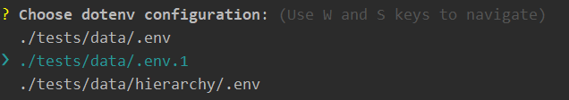

# Dotenv Picker

This is a manager for `dotenv` configuration files(`.env`). It provides more 
convenient way to select which configuration to use while a script run. 

## Features

* [Easy usage](#easy-usage)
* [Switch between .env files on a run](#switch-between-env-files-on-a-run)
* [Works with ts-node](#works-with-ts-node)
* [Use shell to set environment variables](#use-shell-to-set-environment-variables)
* [Pass commonly used features via argv](#pass-commonly-used-features-via-argv)
* [Configure via json configuration file](#configure-via-json-configuration-file)
* [Remember previous selection per script](#remember-previous-selection-per-script)

### Easy usage

#### Installation

```shell script
npm install --save-dev dotenv-picker
```

#### Usage

Create script in your package.json, for ex:
```json
{
  "scripts": {
    "start:dev": "node -r dotenv-picker/select your.script.js"
  }
}
```

### Switch between .env files on a run

*Dotenv Picker* searches in the project's root for all files satisfying `.env*` pattern. Then it shows a simple UI 
allowing you to select which `.env` file to use during this run.



Select `.env` file, hit `ENTER` and you are done!

### Works with ts-node

*Dotenv Picker* may be used along with ts-node too:
```json
{
  "scripts": {
    "start:dev": "ts-node -r dotenv-picker/select your.script.ts"
  }
}
```

### Use shell to set environment variables

Sometimes you may need to call something like this:

```json
{
  "your:command": "npx some.command"
}
```

In this case use:

```json
{
  "your:command": "dotenv-picker npx some.command"
}
```
This will read variables from `.env` file and then will call `npx some.command` via
`execSync` with environment variables passed into it.

### Pass commonly used features via argv

Like *dotenv* package *Dotenv Picker* can read some configuration options from 
command line arguments:

```json
{
  "scripts": {
    "start:dev": "node -r dotenv-picker/select your.script.js dotenv_config_path=.env.1 dotenv_picker_remember_last"
  }
}
```
* `dotenv_config_path` - if there was no previous selection saved for `your.script.js` 
then `.env.1` would be automatically selected on UI.
* `dotenv_picker_remember_last` - instruct *Dotenv Picker* to remember selection for the next run

### Configure via json configuration file

You may wish to configure *Dotenv Picker* behavior. Create `dotenv-picker.json` in your 
project's root for that:

```json
{
  "searchPath": "./tests/data",
  "exclude": ["some-folder"],
  "rememberLastSelection": false,
  "exitWhenNoSelection": false,
  "defaultSelection": ".env.local",
  "scripts": {
    "./your.script.js": {
      "searchPath": "./tests/data/hierarchy",
      "exclude": ["node_modules"],
      "rememberLastSelection": true,
      "exitWhenNoSelection": false,
      "defaultSelection": ".env.local.special"
    }
  }
```
Configuration may be done per script. If you are starting `your.script.js` then you need to
have the corespondent `./your.script.js` field inside the `scripts` section.

Or you can set configuration globally for all scripts at once. The rule here is that
script config has priority over the global config.

All of these settings are *optional*: 
* `searchPath` - where to search for the `.env` files.
* `exclude` - exclude folders from search. More details [here](https://www.npmjs.com/package/ignore).
* `rememberLastSelection` - remember `.env` file selection for the next script run.
* `exitWhenNoSelection` - default is `true`. When `true` and you press ctrl+c process will immediately exit.
* `defaultSelection` - when no selection was made previously this will be used as fallback. Useful
in case you have only one `.env` and want it to be selected automatically not to block 
execution with selection ui. Set this value relative to the `searchPath` or to the project's root. 

### Remember previous selection per script

If you configured *Dotenv Picker* to remember selections then it will create and update
`.dotenv-picker-state.json` in your project's root folder. You might wish to add it your
control version ignore file. The content of this file may look like this:

```json
{
  "scripts": {
    "./test.js": {
      "selection": "./tests/data/hierarchy/.env"
    },
    "./tests/check.js": {
      "selection": "./tests/data/.env.1"
    }
  }
}
``` 

As you can see *Dotenv Picker* stores selections per script.
